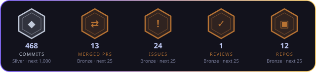
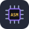

<!-- Header -->
<p align="center"></p>

<p align="center">
  
  
  
  
</p>
<p align="center"></p>
<p align="center"></p>
<!-- loc -->
<p align="center"><sub>Lines of code (code + tests): The Seed 55,937 · TOA - Infernal 34,613 · A.L.I.C.E 0 · The Seed OS 0</sub></p>
<!-- /loc -->

## 🧰 Tech stack

**Languages**

<p align="center">
  &nbsp;&nbsp;&nbsp;&nbsp;
</p>

**Web, mobile & 3D**

<p align="center">
  
</p>

**Blockchain, data & infra**

<p align="center">
  
</p>

<p align="center">
  
  
  
  
  
  
  
</p>


---

## 👋 About me

```python
class V:
    school      = "42"
    roles       = ["Full-Stack Developer", "AI Developer", "Blockchain Developer", "Software Engineer"]
    learning    = ["Kernel", "DevOps", "Cybersecurity"]
    building    = "🌱 The Seed — a Web3 + AI game: tokenized monsters, on-chain assets, signed actions"
    style       = "ship clean, test twice, automate everything"
    remote      = True
    available   = True  # freelance missions & collaborations
    looking_for = ["3D artists", "2D artists / illustrators", "UI artists"]  # sound & music: later
```

---

## 🌱 Featured project — The Seed

<p align="center">
  <a href="https://github.com/VZero911/The_Seed.V0-Public">
    
  </a>
</p>

<details>
<summary><b>🖼️ More screens</b> (the Village art is V2 and will be replaced)</summary>

<p align="center">
  
  
  
</p>
<p align="center"></p>

</details>

An evolving **Web3 + AI** environment, and its first use: a monster-collecting game where monsters, runes and items are
**tokenized assets** you truly own, on-chain. Your identity is a **wallet**; trades between players go through
**smart contracts** (escrow, auctions, on-chain royalties); every action is **signed for free** (gasless) and relayed by the game.

| Layer | What's inside |
|---|---|
| ⛓️ **Smart contracts** | Solidity · Foundry · OpenZeppelin UUPS — tokens, NFT monsters, on-chain **marketplace** (auctions, offers, escrow), polls, achievements · 570 tests, upgrade-safe (validated against the deployed version) |
| 🐍 **Backend** | Python · FastAPI · PostgreSQL · web3.py — SIWE login, encrypted wallet vaults, indexer, deterministic battle engine, 450 species, 575 stages, 1,170 backend tests |
| 🎮 **Game** | Expo · React Native (mobile + web) — summons, runes, dungeons, tower, world boss, guilds, marketplace (UI V2) |
| 🖥️ **Admin console** | React · wagmi · **three.js** — live 3D view of the chain with wallets, block explorer, players, market, AI agents |
| 🤖 **AI** | automation registry, agent runs, MCP servers — the project is built to run itself |
| ✅ **Quality** | ~1,900 tests, 18 browser walks on an isolated stack (game, console, phone layout), security and licence scans, balance simulation |

<p align="center">
  <a href="https://vzero911.github.io/The_Seed.V0-Public/"></a>
  <a href="https://github.com/VZero911/The_Seed.V0-Public"></a>
</p>

### 🌍 Why it matters in real life: a concert ticket, with the code you can see above

The marketplace of the game is a small, tested version of how **any** asset could be traded
without a middleman. The same four steps, on a real example, a **concert ticket**:

| Step | In The Seed today | The same mechanism for a ticket |
|---|---|---|
| **1. Issue** | Only the `MintManager` contract mints a monster NFT, within a daily budget | The organizer mints exactly 5,000 tickets, nobody can add one |
| **2. List** | A player signs a fixed-price sale or an auction (reserve price, anti-sniping) | A fan lists the ticket at face value; the contract can cap the price |
| **3. Swap** | Escrow: the monster and the payment are locked together and swapped in one transaction | Money and ticket change hands at once: no scam, no "I paid but never got it" |
| **4. Share** | 2.5 % of each sale goes to the creator, shown *before* you sign | 5 % of every resale goes to the artist, forever, without a platform |
| **5. Prove** | Every sale is public on the chain, with its history | Provenance and authenticity of the ticket, checkable by anyone |

<p align="center">
  
  
  
</p>
<p align="center"><sub>The real screens: a sale, an offer received, the journal of every trade.</sub></p>

It is not a promise: the contracts are upgrade-tested, covered by invariant tests (no asset is ever
lost or created by a trade) and wait for an audit. **Real value needs audits and a legal frame
first.**

---

## 🎨 Looking for artists

**The Seed** needs faces. I build the chain, the server and the game; I am looking for people to
give it a look worth the world behind it (dark magic, floating island, a giant scary tower):

- 🧊 **3D artists**: monsters, props, the Village island and its tower (glTF, low to mid poly, for three.js and mobile)
- 🖌️ **2D artists / illustrators**: monster art and skins, rune and item icons, banners, key art
- 🧩 **UI artists**: game screens on the V2 design tokens (gold frames, display font)
- 🎵 *Sound and music: not yet, later.*

Credit and a share of the project's contribution points (**POC**, earned, never bought) are on the
table; real money only after audits and a legal frame. See what exists in the
[showcase](https://github.com/VZero911/The_Seed.V0-Public), then write me:
[vzero911@gmail.com](mailto:vzero911@gmail.com) or Discord **vzero911**.

<p align="center">
  
  
  
</p>

---

## 🖤 The Seed OS — *something is growing*

<p align="center"></p>

<p align="center"><i>Same seed. Another soil.</i><br/>
An operating system, built from an Arch Linux base, where the wallet is the identity and the AI is
not an app — it is part of the system.<br/>
<b>Nothing more for now.</b> 👁️</p>

---

## 🔮 Incoming

<details>
<summary><b>👁️ ALICE</b> — to be presented soon</summary>

<br/>

<p align="center"><i>Another piece of the same seed.</i><br/>
<b>ALICE</b> will be introduced here when it is ready. <b>Nothing more for now.</b> 👁️</p>

</details>

---

## 🔭 Right now

- 🌱 **The Seed** — floating-island Village, marketplace UI, graphics V2, admin console in 3D, the first AI agents
- 🎨 **Looking for 3D and 2D artists** — see above
- 🔮 **Incoming: ALICE** — presented soon 👁️
- 🖤 **The Seed OS** — classified 🤫 ([first sprout](https://github.com/VZero911/The_Seed_OS.V0-Public-ArchLinux-Fork-))
- 🎓 **42** — C, C++, algorithms, systems ([42-Public](https://github.com/VZero911/42-Public))
- 📚 Learning **kernel**, **DevOps** and **cybersecurity**

---

## 📬 Let's build something

<p align="center">
  <a href="mailto:vzero911@gmail.com">
    
  </a>
  <a href="https://discord.com/users/vzero911">
    
  </a>
  <a href="https://github.com/vzero911">
    
  </a>
</p>

---

<p align="center"></p>
